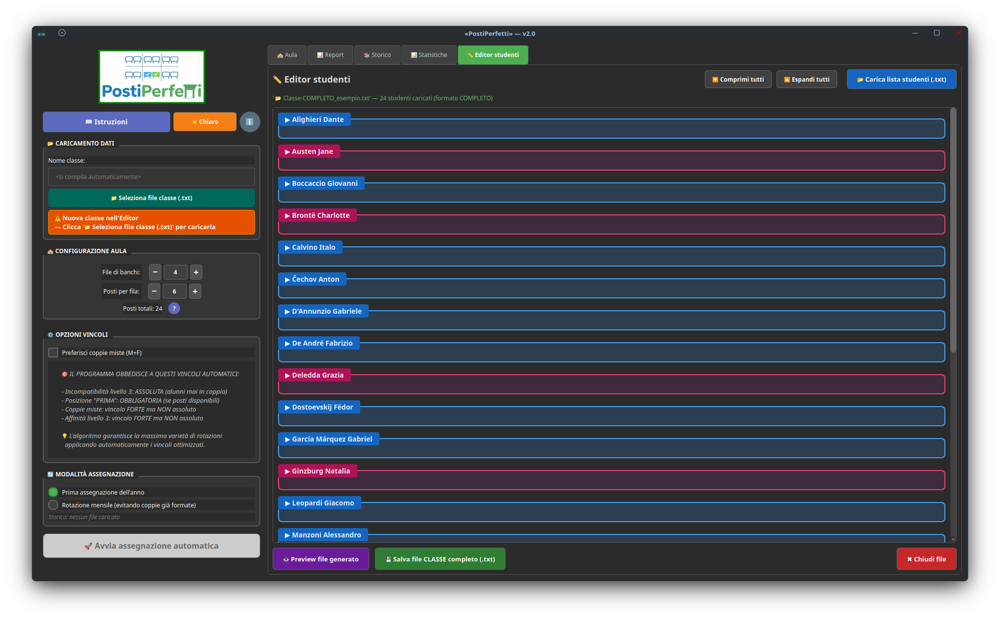
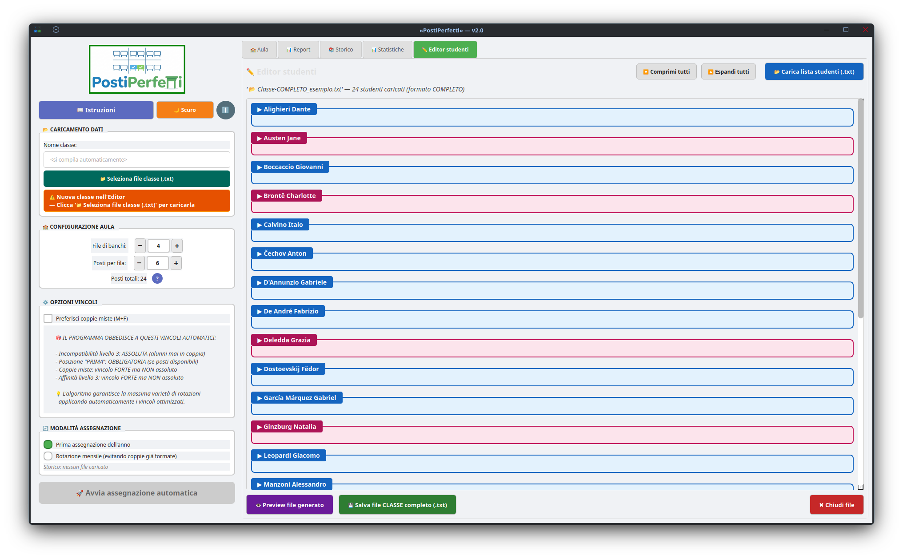
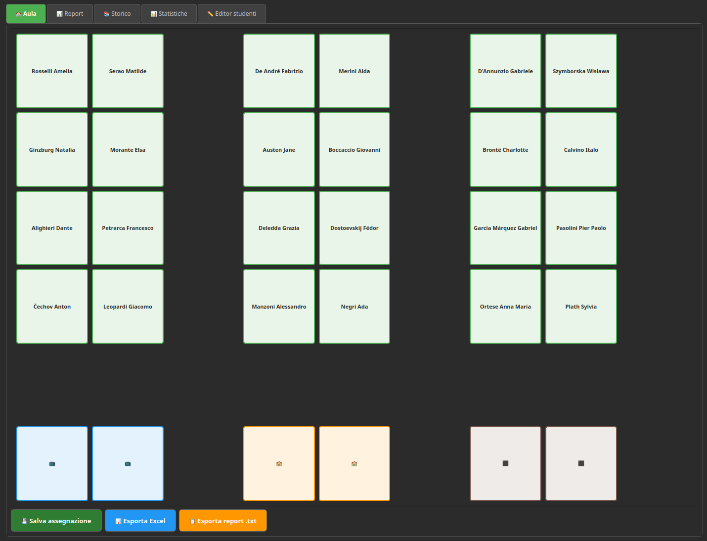
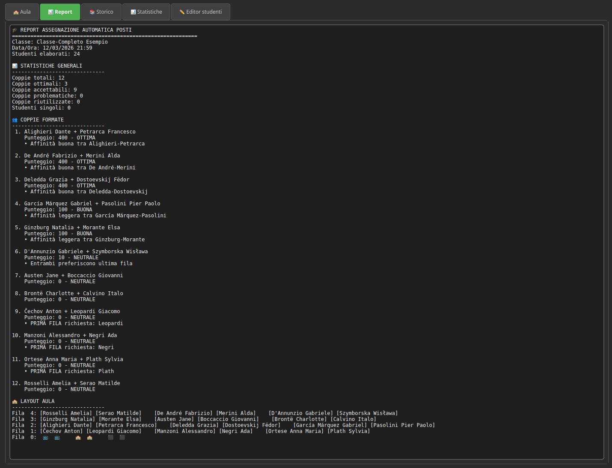
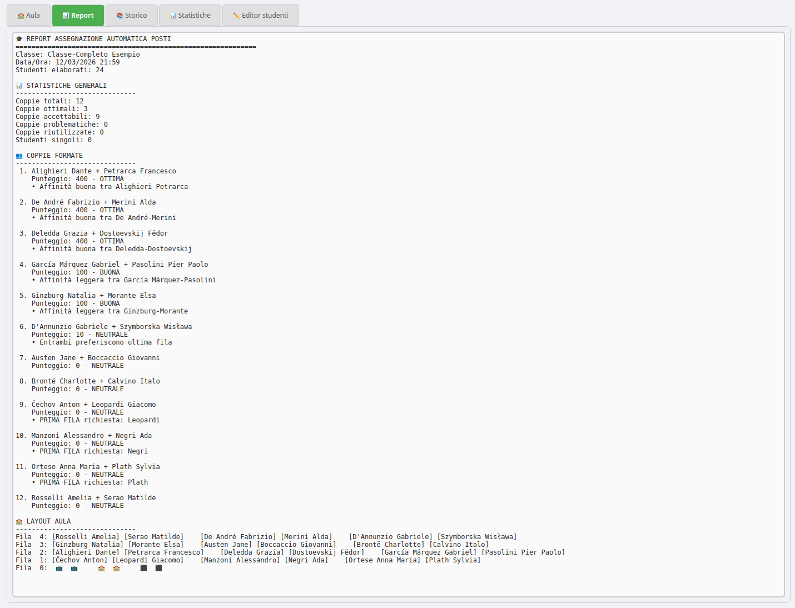
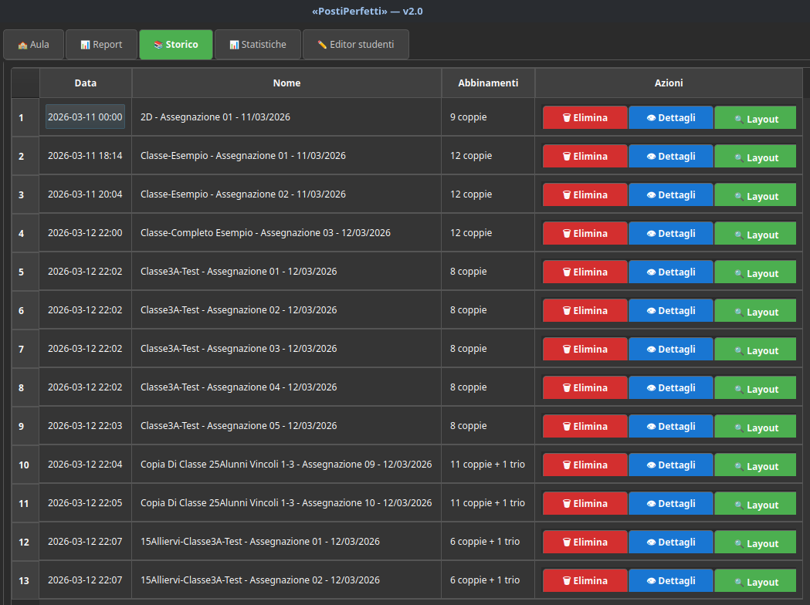
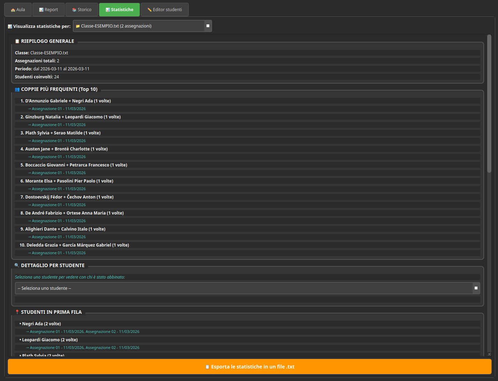
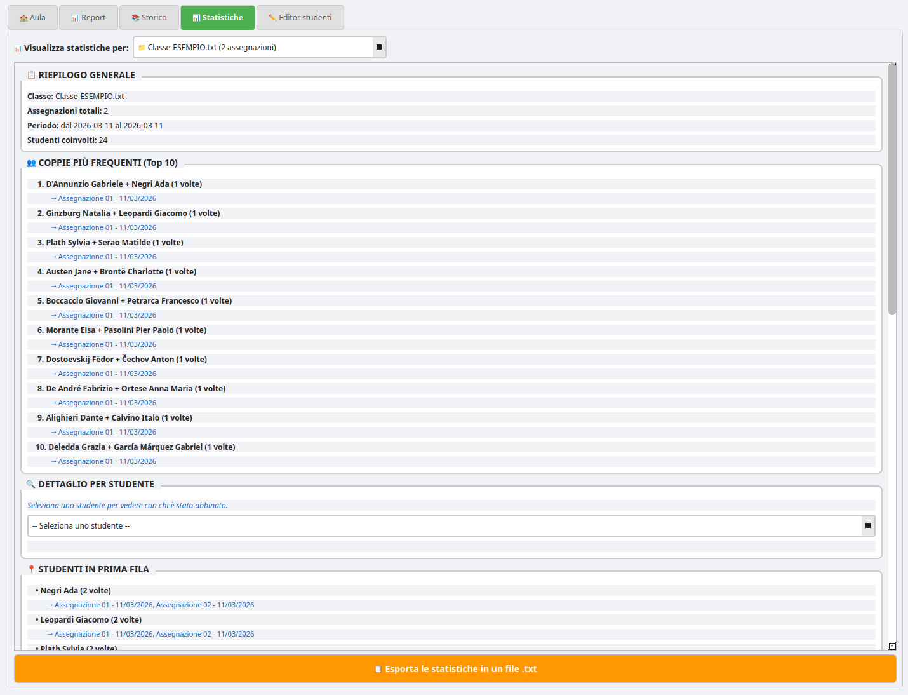

# 📖 «PostiPerfetti» - Guida all'uso

> [!IMPORTANT]
>
> ✅ **«PostiPerfetti» è un programma che utilizza uno speciale algoritmo per aiutare il docente Coordinatore (o qualsiasi insegnante ne abbia la necessità) ad assegnare agli studenti il proprio posto in classe.** 
>
> ✅ Gli allievi vengono distribuiti "a due a due" in modo automatizzato, in un numero di coppie e di file di banchi personalizzabile secondo le esigenze. **Le assegnazioni richiedono in genere da qualche secondo a pochi minuti**.
>
> ✅ Per funzionare, il programma richiede solamente la creazione di un file ".txt" con i dati essenziali degli alunni (*cognome*, *nome*, *genere*). Tramite alcune funzioni molto intuitive sarà poi possibile aggiungere una serie di informazioni e vincoli per ottenere **UNA DISTRIBUZIONE DEGLI ALLIEVI QUANTO PIÙ IN LINEA CON I DESIDERATA DELL'INSEGNANTE**.
>
> ✅ **«PostiPerfetti» non ha alcun accesso alla rete, pertanto non invia nessun dato a terzi**: lavorando esclusivamente in locale, ogni informazione è mantenuta al sicuro all'interno del pc del docente.

☀️ & 🌙

> [!NOTE]
>
> A seconda delle tue preferenze, puoi selezionare un **tema scuro** o un **tema chiaro** per usare il programma.

------





## 1️⃣ PREPARAZIONE DEL FILE STUDENTI TRAMITE "✏️ Editor studenti"

> [!TIP]
>
> ### **① Prepara un file base**

Con un qualsiasi editor di testo del tuo pc, crea un nuovo file .txt (denominandolo ad es. "Lista studenti 1A.txt") inserendo solo `"Cognome;Nome;Genere"` (= M/F) di ogni studente, **uno per riga, in ordine alfabetico**:

| **Esempio di file base** |
| ------------------------ |
| `Alighieri;Dante;M`      |
| `Austen;Jane;F`          |
| `Boccaccio;Giovanni;M`   |
| `Brontë;Charlotte;F`     |
| `Calvino;Italo;M`        |
| eccetera...              |

🔻

> [!TIP]
>
> ### ② Carica il file nell'Editor

Clicca sulla tab **"✏️ Editor studenti"** e poi sul pulsante **"📂 Carica lista studenti (.txt)"**. L'applicazione riconoscerà automaticamente il formato base e creerà una scheda per ogni allievo che hai inserito.

🔻

> [!TIP]
>
> ### ③ Imposta la POSIZIONE

Per ogni studente, usa il **menu a tendina** per selezionarne la posizione:

- `NORMALE` = nessuna preferenza.
- **`PRIMA`** = **OBBLIGO di stare in prima fila** (utile ad es. per gli allievi più propensi a distrarsi, con difficoltà di vista o altri bisogni particolari).
- `ULTIMA` = preferenza per l'ultima fila (utile ad es. per allievi di alta statura o per altre esigenze).

🔻

> [!TIP]
>
> ### ④ Aggiungi le INCOMPATIBILITÀ

Se è il caso di tenere separati alcuni allievi (che in banco assieme rischierebbero di distrarsi o disturbare), è consigliabile stabilire tra loro una "incompatibilità". Clicca su **"➕ Aggiungi INCOMPATIBILITÀ"** nella scheda dello studente. Apparirà una riga con:

- Un **menu a tendina** con tutti gli altri studenti della classe — seleziona il compagno.
- Un **menu livello** — scegli il grado di incompatibilità:

| **Livello** | **Significato** | **Quando usarlo**                                  |
| ----------- | --------------- | -------------------------------------------------- |
| **1**       | Leggera         | Meglio se non vicini, ma accettabile se necessario |
| **2**       | Media           | Evitare se possibile, penalità significativa       |
| **3**       | **Assoluta**    | **MAI vicini — vincolo inviolabile**               |

> 💡 **NOTA:** Puoi aggiungere più incompatibilità per lo stesso studente, cliccando di nuovo il bottone ➕.

🔻

> [!TIP]
>
> ### ⑤ Aggiungi le AFFINITÀ

Se è il caso di tenere uniti certi allievi (per promuoverne la collaborazione, l'integrazione o per altre ragioni), è utile stabilire tra loro una "affinità". Segui la stessa procedura delle incompatibilità, usando **"➕ Aggiungi AFFINITÀ"**. 

I livelli indicano quanto è desiderabile che i due studenti stiano vicini:

| **Livello** | **Significato**                                              |
| ----------- | ------------------------------------------------------------ |
| **1**       | Affinità leggera (piccolo bonus)                             |
| **2**       | Affinità buona (bonus significativo)                         |
| **3**       | **Affinità forte — l'algoritmo cercherà di metterli vicini** |

> 💡 **NOTA:** Puoi aggiungere più affinità per lo stesso studente, cliccando di nuovo il bottone ➕.

🔻

> [!TIP]
>
> ### ⑥ BIDIREZIONALITÀ automatica

**Non devi preoccuparti di ripetere i vincoli.** Se imposti "D'Annunzio Gabriele incompatibile con Deledda Grazia (livello 3)", l'Editor aggiungerà **automaticamente** "Deledda Grazia incompatibile con D'Annunzio Gabriele (livello 3)". Lo stesso vale per le affinità, per le modifiche di livello e per le rimozioni.

🔻

> [!TIP]
>
> ### ⑦ Rimuovere un vincolo

Clicca il bottone **"Rimuovi"** accanto al vincolo da eliminare. Il vincolo speculare sull'altro studente verrà rimosso automaticamente.

🔻

> [!TIP]
>
> ### ⑧ Verifica e salva

- Clicca su **"👁️ Preview file generato"** per vedere un'anteprima del file .txt che verrà creato.

- Clicca su **"💾 Esporta file completo"** per salvare il file .txt definitivo della classe.

- È consigliabile **dare a questo file il NOME DELLA CLASSE** 

```
ad esempio = "Classe1A.txt", oppure "Classe1A_2026-27.txt"
```

------

> [!NOTE]
>
> ### 💡 Modifica dei vincoli in corso d'anno
>
> Se in futuro vorrai rimuovere, aggiungere o cambiare dei vincoli, basterà ricaricare nell'Editor il file .txt completo della classe. Le schede verranno popolate automaticamente con tutti i dati esistenti di ciascun allievo, pronte per essere modificate. 
>
> Se invece dovrai aggiungere o rimuovere un allievo, dovrai aprire il file .txt della classe e cancellarne la riga, oppure aggiungerlo (con `Cognome;Nome;Genere`) nella posizione alfabeticamente corretta.

------

## 2️⃣ CARICAMENTO E CONFIGURAZIONE

### 🔹**Passo 1 — Carica il file:** 

- Clicca sul pulsante **"📂 Seleziona file classe (.txt)"** presente nel pannello a sinistra e seleziona il file completo preparato con l'Editor studenti. Il programma mostrerà il numero di studenti caricati.

### 🔹**Passo 2 — Configura le opzioni:** 

- **"Gestione numero dispari"**: se gli studenti sono in numero dispari, scegli in quale fila andrà posizionato il trio (3 studenti allo stesso banco): 'prima', 'ultima' o 'centrale'.

- **"Preferisci coppie miste (M+F)"**: se questo flag è attivato, l'algoritmo preferirà coppie maschio-femmina (non è un obbligo assoluto, ma un bonus forte).

- **"Rotazione mensile"**: quando si salva la prima assegnazione, questo flag si attiverà in automatico dalla seconda assegnazione in poi. L'algoritmo eviterà il più possibile di ripetere coppie già formate nelle assegnazioni precedenti.

------

## 3️⃣ AVVIO DELL'ASSEGNAZIONE

[Inserire qui lo screenshot del popup di assegnazione e dei tentativi dell'algoritmo]

Quando il file della classe sarà pronto e caricato, clicca su **"🚀 Avvia assegnazione automatica"**. 

💥 **L'algoritmo lavorerà in 4 tentativi progressivi, rispettando SEMPRE i vincoli "ASSOLUTI" (= 'posizione PRIMA' e 'incompatibilità 3') e facendo il possibile per NON RIPETERE COPPIE GIÀ FORMATE**.

| **Tentativo** | **Strategia**                                                |
| ------------- | ------------------------------------------------------------ |
| 1             | Tutti i vincoli attivi, nessuna coppia ripetuta              |
| 2             | Vincoli deboli (livello 1) rilassati                         |
| 3             | Vincoli medi (livello 2) rilassati                           |
| 4             | Solo vincoli ASSOLUTI, coppie ripetute ammesse con penalità progressiva |

- 💬 Al termine dell'elaborazione apparirà un **POPUP di riepilogo con le statistiche degli abbinamenti** creati. 
- ❗ Eventuali **coppie riutilizzate** saranno evidenziate in **colore ocra**.

------

> [!NOTE]
>
> ### 💡 File di configurazione
>
> Tutte le modifiche ai file e ogni assegnazione salvata vengono memorizzate all'interno del file "postiperfetti_configurazione.json". Questo file non deve essere aperto o modificato direttamente. Solo nel caso in cui si desideri cancellare l'intero Storico delle assegnazioni può essere eliminato, e verrà ricreato "da zero" dal programma in occasione della prima nuova assegnazione.

------

## 4️⃣ VISUALIZZAZIONE DEI RISULTATI




### 🍀 La Tab "🏫 AULA"

Mostrerà la disposizione grafica dell'aula. Gli arredi (LIM, cattedra, lavagna) sono in basso, le file di banchi salgono verso l'alto. Da qui potrai agire sui pulsanti:

- **💾 Salva assegnazione**: salva la distribuzione degli allievi appena ottenuta nello Storico del programma, per consultarla in futuro e per memorizzare le coppie formate.
- **📊 Esporta Excel**: genera un file .xlsx liberamente modificabile, con un layout ottimizzato per la stampa in A4.
- **📋 Esporta report .txt**: salva il report testuale completo con le caratteristiche degli abbinamenti effettuati.

[Inserire qui lo screenshot della disposizione dell'aula]





### 🍀 La Tab "📊 REPORT"

Mostra il report testuale dettagliato con tutte le coppie formate, i punteggi, le note sui vincoli e il layout dell'aula in formato testo. Le coppie riutilizzate sono evidenziate in **colore ocra**.




### 🍀 La Tab "📚 STORICO"

Elenca tutte le assegnazioni salvate. Per ciascuna potrai agire sui pulsanti:

- **📋 Dettagli**: visualizza il report completo dell'assegnazione. Facendo 'doppio clic' sul nome puoi se necessario modificarlo.
- **🔍 Layout**: apre il layout grafico con la possibilità di esportare in Excel.
- **🗑️ Elimina**: rimuove l'assegnazione dallo Storico (consentendo di 'ri-abbinare' in futuro gli studenti che erano stati messi assieme in quella assegnazione).





### 🍀 La Tab "📊 STATISTICHE"

Analizza l'intero Storico della classe (o di più classi) mostrando le coppie più frequenti, gli studenti più spesso in prima fila e le coppie mai formate. Utile per verificare l'equità e le caratteristiche delle rotazioni succedutesi nel tempo.

------

## 5️⃣ FLUSSO DI LAVORO CONSIGLIATO

### 🔹Prima assegnazione dell'anno (settembre)

1. **Prepara tramite "✏️ Editor studenti" il file .txt della classe** con tutti i dati necessari.

2. **Seleziona il file della classe**. Il programma imposterà in automatico la "Prima assegnazione".

3. Aggiungi se necessario 'File di banchi' e/o 'Posti per fila'.

4. Assegna se necessario la posizione del 'trio' e l'**eventuale preferenza per le 'coppie miste'**.

5. **Avvia l'assegnazione, salvala nello Storico ed esportala in Excel**.

6. Apri e modifica se necessario il foglio Excel, stampalo e posizionalo in classe.


### 🔹Assegnazioni successive (ottobre → giugno)

1. Mantieni lo stesso file .txt della classe (o ricaricalo se hai iniziato una nuova sessione del programma).
2. «PostiPerfetti» attiverà in automatico il flag della "Rotazione mensile".
3. **Avvia tutte le assegnazioni necessarie, RICORDANDOTI DI SALVARE OGNUNA NELLO STORICO**, ed esportale di volta in volta in Excel per la stampa.

Nel caso tu non abbia salvato in tempo i file Excel delle varie assegnazioni, potrai sempre farlo in un secondo momento, accedendo alla tab "📚 STORICO" e cliccando sul pulsante "🔍 Layout".

> [!NOTE]
>
> ### 💡 Modifica dei vincoli in corso d'anno
>
> Se le dinamiche della classe dovessero cambiare, modifica con "✏️ Editor studenti" il file .txt della classe - aggiornando 'posizione', 'incompatibilità' e 'affinità' - e poi salvalo.

------

------

## ⚠️ RISOLUZIONE DEI PROBLEMI

| **Problema**                                              | **Soluzione**                                                |
| --------------------------------------------------------- | ------------------------------------------------------------ |
| Popup di segnalazione errore al caricamento del file .txt | Il programma verifica che la sintassi di ogni riga sia corretta e propone in automatico gli aggiustamenti necessari, avvisando con un 'popup'. È consigliabile, in questi casi, rivedere la correttezza dei dati degli allievi nella tab "✏️ Editor studenti". |
| Studente "non trovato" nei vincoli                        | Il nome nei vincoli deve corrispondere **esattamente** a Cognome + Nome (es: `Pasolini Pier Paolo`, non `Pasolini Pier`). |
| ❗ TROPPE COPPIE RIUTILIZZATE                              | Con molti vincoli di incompatibilità (livello 3), le combinazioni possibili si riducono. **Valuta se qualche vincolo di livello 3 può diventare livello 2.** |
| ‼️ L'ASSEGNAZIONE FALLISCE IN TUTTI I TENTATIVI            | I vincoli assoluti creano una situazione matematicamente impossibile da risolvere. **Riduci il numero di incompatibilità di 'livello 3', di posizione 'PRIMA' oppure rimuovi il vincolo di 'genere misto'.** |

------

------


«PostiPerfetti» — Sviluppato in Python dal prof. Omar Ceretta

🇮🇹 Istituto Comprensivo di Tombolo e Galliera Veneta (PADOVA) 🇮🇹