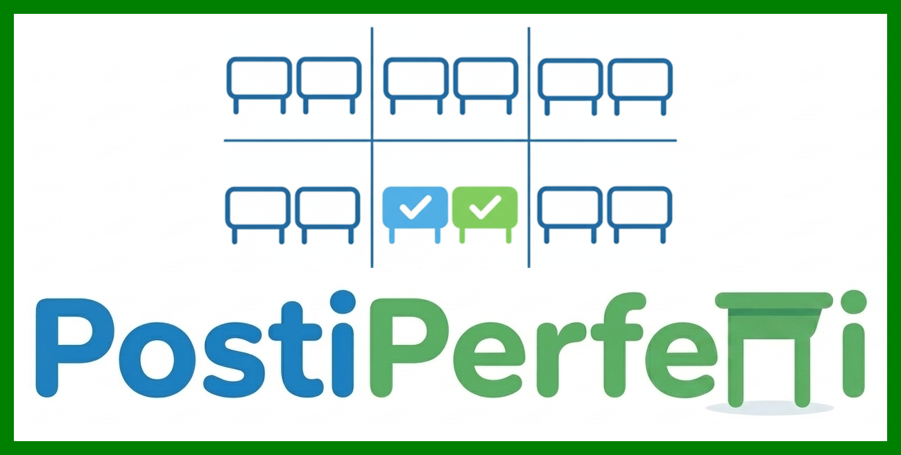

# 📖 «PostiPerfetti» 📖

> [!IMPORTANT]
>
> ✅ **«PostiPerfetti» è un programma gratuito e *open source* che utilizza uno speciale algoritmo per aiutare il docente Coordinatore (o qualsiasi insegnante ne abbia la necessità) ad assegnare agli studenti il proprio posto in classe.** 
>
> ✅ Per funzionare, esso **richiede la creazione di un file ".txt" con i dati essenziali degli alunni (*cognome*, *nome*, *genere*)**. Tramite alcune funzioni intuitive sarà poi possibile aggiungere una serie di informazioni e vincoli ('affinità' e 'incompatibilità' fra allievi, loro 'posizione' rispetto alla cattedra, eventuale preferenza per 'coppie miste M+F') per ottenere **UNA DISTRIBUZIONE DEGLI ALLIEVI QUANTO PIÙ IN LINEA CON I DESIDERATA DELL'INSEGNANTE**.
>
> ✅ Gli allievi verranno distribuiti "a due a due" in modo automatizzato, in un numero di coppie e di file di banchi personalizzabile secondo le esigenze. **Le assegnazioni richiedono in genere da qualche secondo a due/tre minuti** (a seconda del numero e della rigidità dei "vincoli" che si sono predisposti).
>
> ✅ **«PostiPerfetti» non ha alcun accesso alla rete, pertanto non invia nessun dato a terzi**. Lavorando esclusivamente in locale, ogni informazione è quindi mantenuta al sicuro all'interno del pc del docente.

> [!NOTE]
>
> A seconda delle tue preferenze, per usare l'interfaccia puoi selezionare un **🌚 Tema scuro** o un **☀️ Tema chiaro**, che apparirà come nei seguenti screenshot (clicca per allargare le immagini):
> 
> [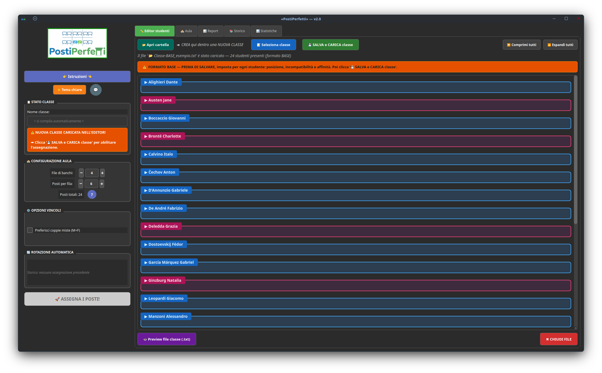](https://raw.githubusercontent.com/Omar-Ceretta/PostiPerfetti/refs/heads/main/screens/000_editor-scuro.png)
> 
> [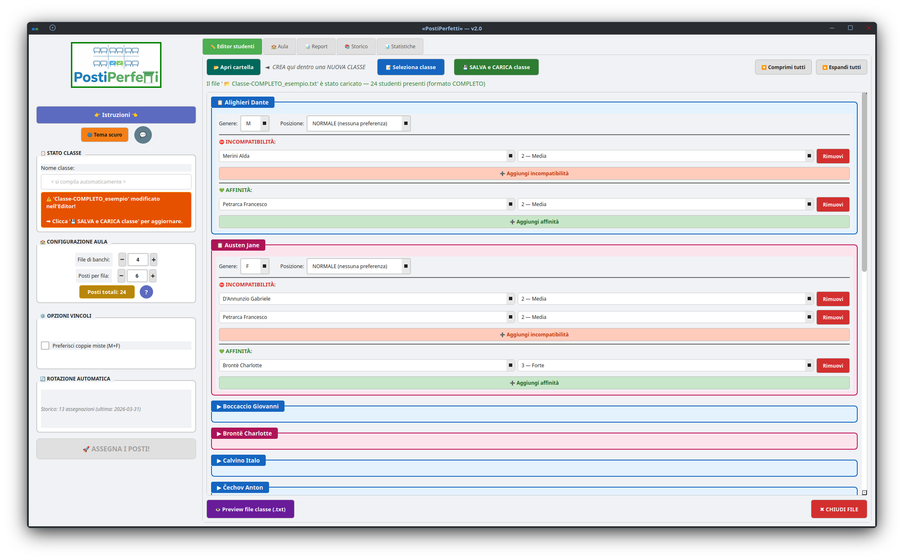](https://github.com/Omar-Ceretta/PostiPerfetti/blob/main/screens/000_editor-chiaro.png?raw=true)

------

## 📥 Download

**[Scarica «PostiPerfetti» per Windows e Linux](https://github.com/Omar-Ceretta/PostiPerfetti/releases/latest)**

------

## [1] - GUIDA AL PRIMO UTILIZZO

> [!TIP]
>
> ### **1 ~ Prepara un file .txt di base**

**Dopo aver installato e avviato il programma, clicca sul pulsante "📂 Apri cartella"**. Si aprirà la cartella che contiene le classi. Con un qualsiasi editor di testo, **crea un nuovo file .txt con il nome della tua classe** (ad es. `"Classe1A.txt"` oppure `"Classe1A_2026-27.txt"`).

**Dentro scrivi solo `"Cognome;Nome;Genere"`** (= M/F) **di ogni studente, uno per riga, in ordine alfabetico**. Separa i tre elementi con due punti e virgola (";") e non usare spazi, come nel seguente esempio:

| **Esempio di file base** |
| ------------------------ |
| `Alighieri;Dante;M`      |
| `Austen;Jane;F`          |
| `Boccaccio;Giovanni;M`   |
| `Brontë;Charlotte;F`     |
| `Calvino;Italo;M`        |
| *eccetera...*            |

> [!TIP]
>
> ### 2 ~ Imposta la POSIZIONE

Per ogni studente, **usa il menu a tendina per selezionarne la *posizione***:

- `NORMALE` = nessuna preferenza.
- **`PRIMA`** = **OBBLIGO di stare in prima fila** (utile ad es. per gli allievi più propensi a distrarsi, con difficoltà di vista o altri bisogni particolari).
- `ULTIMA` = preferenza per l'ultima fila (utile ad es. per allievi di alta statura o per altre esigenze).
- 🔴 **`FISSO`** = **posizione fissa in prima fila, nel primo banco a sinistra**.

> [!IMPORTANT]
>
> ### 🔴 La posizione "FISSO" (studenti con Bisogni Educativi Speciali)
>
> La posizione **FISSO** è pensata per gli allievi con **BES** o altre esigenze particolari che richiedono una collocazione stabile, vicina alla cattedra e costante nel tempo.
>
> **Come funziona:**
> - Lo studente FISSO viene **sempre assegnato al primo banco a sinistra della prima fila**, vicino alla cattedra. La sua posizione non cambia da una rotazione all'altra.
> - **L'algoritmo sceglie automaticamente il compagno migliore** da affiancargli, selezionando quello con la massima compatibilità. Il compagno affiancato avrà a sua volta un altro compagno al banco adiacente: in questo modo, se l'allievo BES dovesse temporaneamente uscire dall'aula, il compagno non resta isolato. Ad ogni nuova rotazione, **il compagno accanto al FISSO cambia**, garantendo equità e varietà nei turni.
> - **NOTA 1: è possibile designare al massimo 1 studente FISSO** per classe.
>
> - **NOTA 2: senza studente FISSO, la gestione del 'trio' (banco da 3) si attiva quando gli studenti sono in numero dispari** (es. 17, 19, 21...). **Con uno studente FISSO, la logica si inverte**: il FISSO occupa 1 posto da solo e i rimanenti N−1 studenti vengono distribuiti in coppie. Il 'trio' si forma quindi quando la classe è in **numero pari** (es. 16, 18, 20...).
>
> - **NOTA 3:** quando uno studente è impostato come FISSO, le sezioni "Incompatibilità" e "Affinità" nella sua scheda vengono **disabilitate**. Per influenzare chi gli siederà accanto, è sufficiente impostare i vincoli **sugli altri studenti** (ad es. impostando una "*Affinità di livello 3*" nelle schede dei compagni desiderati).

> [!TIP]
>
> ### 3 ~ Aggiungi le INCOMPATIBILITÀ

**Se è il caso di tenere SEPARATI alcuni allievi** (che in banco assieme rischierebbero di distrarsi o disturbare), **è consigliabile stabilire tra loro una "incompatibilità"**. 

Clicca su **"➕ Aggiungi INCOMPATIBILITÀ"** nella scheda dello studente. Apparirà una riga con:

- Un **menu a tendina** con tutti gli altri studenti della classe ⇾ seleziona il compagno.
- Un **menu livello** ⇾ scegli uno fra questi 3 gradi di incompatibilità:

| **Livello** | **Significato**              | **Quando usarlo**                                  |
| ----------- | ---------------------------- | -------------------------------------------------- |
| **1**       | Incompatibilità leggera      | Meglio se non vicini, ma accettabile se necessario |
| **2**       | Incompatibilità media        | Evitare se possibile, penalità significativa       |
| **3**       | **Incompatibilità ASSOLUTA** | **MAI vicini — vincolo inviolabile**               |

> 💡 **NOTA:** **Puoi aggiungere più incompatibilità per lo stesso studente**, cliccando di nuovo il bottone ➕.

> [!TIP]
>
> ### 4 ~ Aggiungi le AFFINITÀ

**Se è il caso di tenere UNITI certi allievi** (per "bilanciarne" i livelli e promuovere la collaborazione, per facilitare l'integrazione o altre ragioni), **è utile stabilire tra loro una "affinità"**. 

Segui la stessa procedura delle incompatibilità, usando **"➕ Aggiungi AFFINITÀ"**. 

I 3 livelli indicano quanto è desiderabile che i due studenti stiano vicini:

| **Livello** | **Significato**    | **Quando usarlo**                                        |
| ----------- | ------------------ | -------------------------------------------------------- |
| **1**       | Affinità leggera   | Per dare un piccolo bonus alla vicinanza                 |
| **2**       | Affinità buona     | Per dare un bonus più significativo alla vicinanza       |
| **3**       | **Affinità forte** | **Per far sì che l'algoritmo cerchi di metterli vicini** |

> 💡 **NOTA:** **Puoi aggiungere più affinità per lo stesso studente**, cliccando di nuovo il bottone ➕.

> [!TIP]
>
> ### 5 ~ BIDIREZIONALITÀ automatica

**Non devi preoccuparti di ripetere i vincoli.** Se imposti "D'Annunzio Gabriele incompatibile con Deledda Grazia (livello 3)", l'Editor aggiungerà **automaticamente** "Deledda Grazia incompatibile con D'Annunzio Gabriele (livello 3)". Lo stesso vale per le affinità, per le modifiche di livello e per le rimozioni.

> [!TIP]
>
> ### 6 ~ Rimuovere un vincolo

Clicca il bottone **"Rimuovi"** accanto al vincolo da eliminare. Il vincolo speculare sull'altro studente verrà rimosso automaticamente.

> [!TIP]
>
> ### 7 ~ Verifica e salva

- Clicca su **"👁️ Preview file generato"** per vedere un'anteprima del file .txt che verrà creato.

- Clicca su **"💾 SALVA e CARICA classe"** per salvare il file .txt della classe.

- La classe verrà caricata nel programma, **pronta per avviare le assegnazioni.**

------

> [!NOTE]
>
> ### ⚙️ Modifica dei vincoli in corso d'anno
>
> Se in futuro vorrai rimuovere, aggiungere o cambiare dei vincoli, basterà ricaricare nell'Editor il file .txt della classe con il pulsante **"📝 Seleziona classe"**. Le schede verranno popolate automaticamente con tutti i dati esistenti di ciascun allievo, pronte per essere modificate. 
>
> Se invece bisognasse rimuovere o aggiungere un allievo (per trasferimento, cambio sezione, bocciatura...), dovrai aprire manualmente il file .txt della classe e cancellarne la riga, oppure aggiungerlo (con `Cognome;Nome;Genere`) nella posizione alfabeticamente corretta.

------

## [2] - CARICAMENTO E CONFIGURAZIONE

### 🔷 **Passo 1 — Carica il file:** 

- Una volta preparato il tuo file con tutti i vincoli, sei già pronto al "Passo 2". 

  Se invece vuoi effettuare le assegnazioni per un'altra classe, clicca sul pulsante **"📝 Seleziona classe"** presente nella tab "✏️ Editor studenti". Il programma mostrerà il numero di studenti caricati e **configurerà automaticamente il numero di file di banchi** necessarie.

### 🔷 **Passo 2 — Configura le opzioni:** 

I box **"Configurazione aula"**, **"Opzioni vincoli"** e **"Rotazione automatica"** diventano attivi solo dopo aver caricato una classe con "💾 SALVA e CARICA classe".

- **"Configurazione aula"**: il programma calcola automaticamente il numero minimo di file necessarie per la tua classe. Puoi comunque modificarlo manualmente con i pulsanti + e −. Verrai avvertito in caso di 'posti insufficienti'.

- **"Gestione numero dispari"**: se è necessario un banco da 3 (trio), potrai **scegliere in quale fila posizionarlo**: 'prima', 'ultima' o 'centrale'. **Nota:** con uno studente FISSO, il trio si attiva quando la classe è in numero pari. Se decidi di disporlo in posizione 'prima', troverai in prima fila 4 allievi raggruppati (= l'allievo FISSO + il 'trio'); se invece lo disporrai in posizione 'centrale' o 'ultima', troverai in prima fila 3 allievi raggruppati (= l'allievo FISSO + una coppia) e il trio in posizione 'centrale' o 'ultima'.

- **"Preferisci coppie miste (M+F)**": se attivi questo flag, **l'algoritmo preferirà coppie maschio-femmina** (non è un obbligo assoluto, ma un bonus forte).

- **"Rotazione automatica"**: l'algoritmo consulta **sempre** lo Storico delle assegnazioni salvate per evitare di ripetere coppie già formate. Alla prima assegnazione dell'anno, lo Storico è vuoto e quindi non ha effetto; dalle assegnazioni successive in poi, le coppie precedenti vengono automaticamente evitate.

------

## [3] - AVVIO DELL'ASSEGNAZIONE

Quando il file della classe sarà pronto e caricato, clicca su **"🚀 Assegna i posti!"**. 

💥 **L'algoritmo lavorerà in 4 tentativi progressivi, rispettando SEMPRE i vincoli "ASSOLUTI" (= 'posizione PRIMA', 'posizione FISSO' e 'incompatibilità 3') e facendo il possibile per NON RIPETERE COPPIE GIÀ FORMATE**.

| **Tentativo** | **Strategia**                                                |
| ------------- | ------------------------------------------------------------ |
| 1             | Tutti i vincoli attivi, nessuna coppia ripetuta              |
| 2             | Vincoli deboli (livello 1) rilassati                         |
| 3             | Vincoli medi (livello 2) rilassati                           |
| 4             | Solo vincoli ASSOLUTI, coppie ripetute ammesse con penalità progressiva |

- 💬 Al termine dell'elaborazione apparirà un **POPUP di riepilogo con le statistiche degli abbinamenti** creati. 
- ❗ Eventuali **coppie riutilizzate** saranno evidenziate in **colore ocra**.

------

> [!NOTE]
>
> ### ⚙️ File di configurazione
>
> Tutte le modifiche ai file e ogni assegnazione salvata vengono memorizzate all'interno del file "postiperfetti_configurazione.json". Questo file NON deve essere aperto o modificato direttamente. Solo nel caso in cui si desideri cancellare l'intero "Storico" delle assegnazioni può essere eliminato, e verrà ricreato *da zero* dal programma in occasione della prima nuova assegnazione.

> [!NOTE]
>
> 💡 **Se rinomini un file .txt**, il programma lo riconoscerà automaticamente tramite i nomi degli studenti.

------

## [4] - VISUALIZZAZIONE DEI RISULTATI

### 🍀 La Tab "🏫 AULA"

[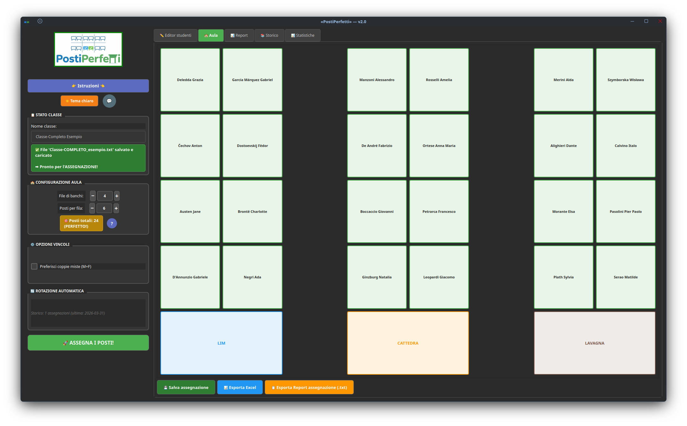](https://github.com/Omar-Ceretta/PostiPerfetti/blob/main/screens/001_aula-scuro.png?raw=true)

[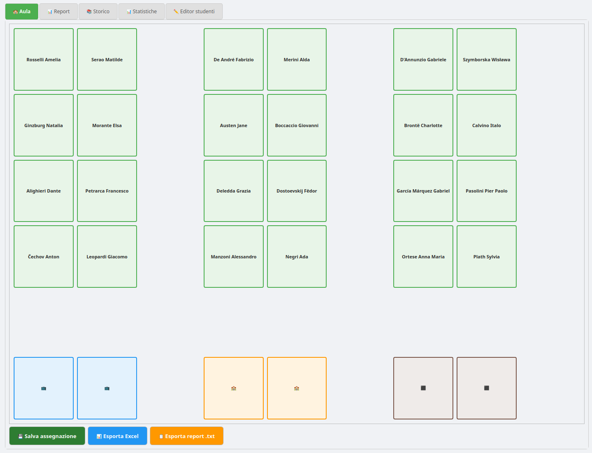](https://github.com/Omar-Ceretta/PostiPerfetti/blob/main/screens/001_aula-chiaro.png?raw=true)

La Tab "🏫 AULA" mostra la disposizione grafica dell'aula. Gli arredi (LIM, cattedra, lavagna) sono in basso, le file di banchi salgono verso l'alto. Da qui potrai agire sui pulsanti:

- **💾 Salva assegnazione**: salva la distribuzione degli allievi appena ottenuta nello "Storico" del programma, per consultarla in futuro e per memorizzare le coppie formate.
- **📊 Esporta Excel**: genera **un file .xlsx liberamente modificabile a seconda delle proprie esigenze**, con un layout ottimizzato per la stampa in A4.
- **📋 Esporta report .txt**: salva il report testuale completo con le caratteristiche degli abbinamenti effettuati.

### 🍀 La Tab "📊 REPORT"

[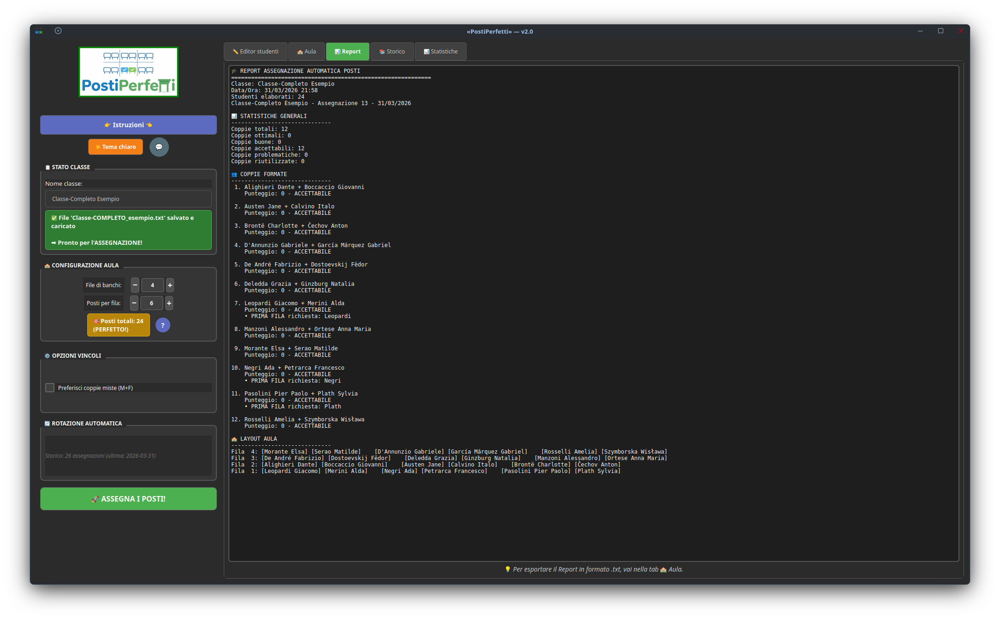](https://github.com/Omar-Ceretta/PostiPerfetti/blob/main/screens/002_report-scuro.png?raw=true)

[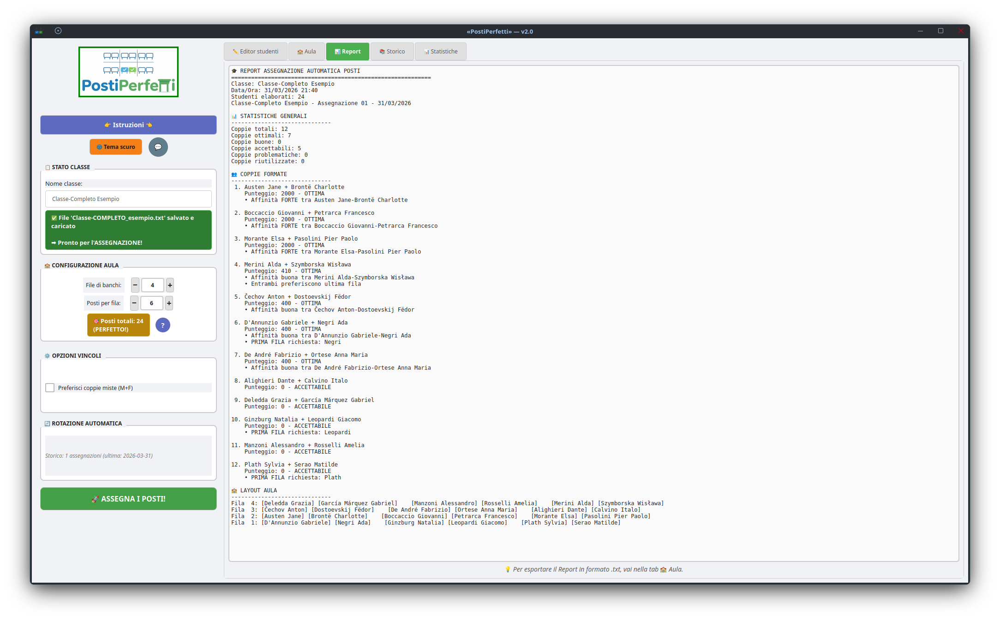](https://github.com/Omar-Ceretta/PostiPerfetti/blob/main/screens/002_report-chiaro.png?raw=true)

La Tab "📊 REPORT" mostra il report testuale dettagliato con tutte le coppie formate, i punteggi, le note sui vincoli e il layout dell'aula in formato testo. **Le coppie eventualmente riutilizzate saranno evidenziate in colore ocra**.

### 🍀 La Tab "📚 STORICO"

[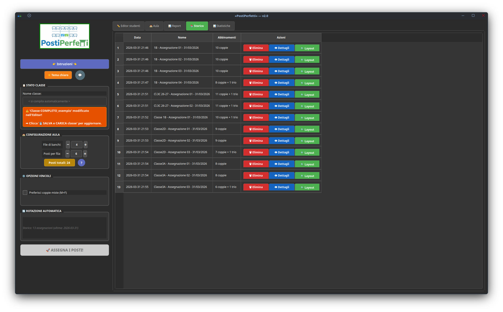](https://github.com/Omar-Ceretta/PostiPerfetti/blob/main/screens/003_storico-scuro.png?raw=true)

[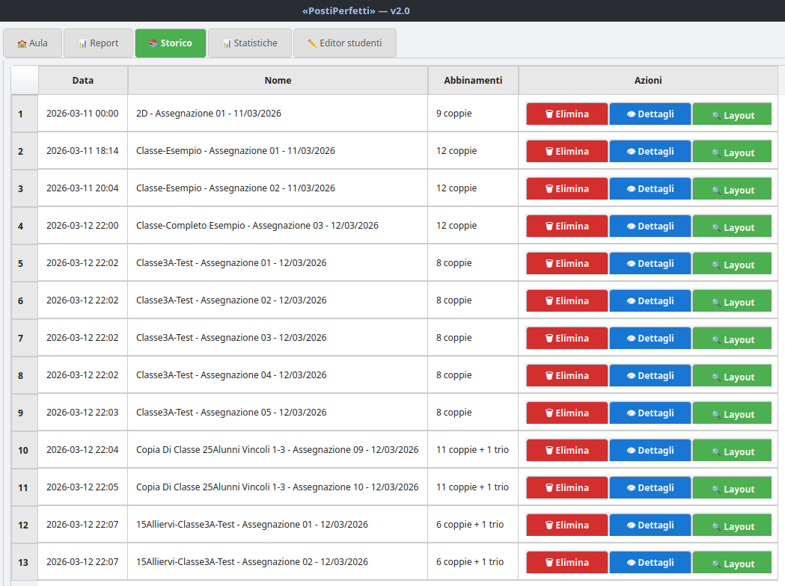](https://github.com/Omar-Ceretta/PostiPerfetti/blob/main/screens/003_storico-chiaro.png?raw=true)

La Tab "📚 STORICO" elenca tutte le assegnazioni salvate. Volendo, puoi **modificare il 'Nome' di ogni assegnazione** facendo doppio clic su di essa. Per ciascuna inoltre potrai agire sui pulsanti:

- **📋 Dettagli**: visualizza il report completo dell'assegnazione, che si può anche esportare.
- **🔍 Layout**: apre il layout grafico con la possibilità di esportare in Excel.
- **🗑️ Elimina**: rimuove l'assegnazione dallo "Storico" (consentendo di 'ri-abbinare' in futuro gli studenti che erano stati messi assieme in quella assegnazione).

### 🍀 La Tab "📊 STATISTICHE"

[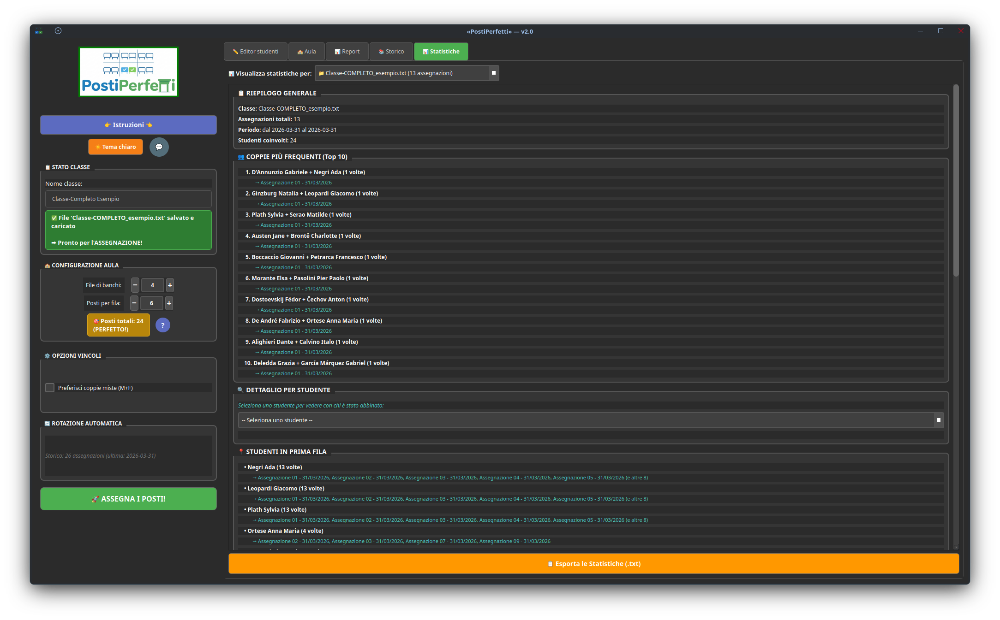](https://github.com/Omar-Ceretta/PostiPerfetti/blob/main/screens/004_statistiche-scuro.png?raw=true)

[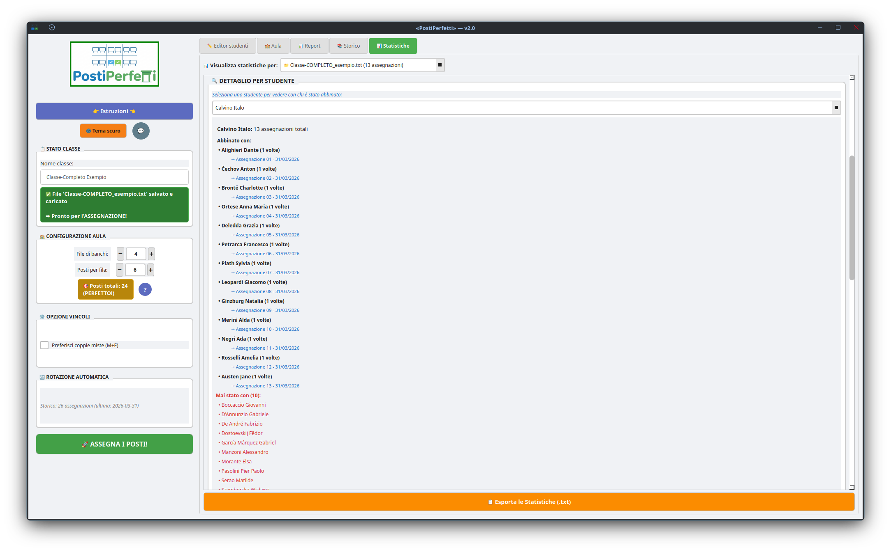](https://github.com/Omar-Ceretta/PostiPerfetti/blob/main/screens/004_statistiche-chiaro.png?raw=true)

La Tab "📊 STATISTICHE" analizza l'intero "Storico" della classe (o di più classi) mostrando le coppie più frequenti, gli studenti più spesso in prima fila e le coppie mai formate. Utile per verificare l'equità e le caratteristiche delle rotazioni succedutesi nel tempo.

------

## [5] - FLUSSO DI LAVORO CONSIGLIATO

### 🔷 Prima assegnazione dell'anno (settembre):

1. **Prepara tramite "✏️ Editor studenti" il file .txt della classe** con tutti i dati necessari (inclusa l'eventuale posizione FISSO per studente BES).

2. **Seleziona il file della classe** con "💾 SALVA e CARICA classe". Il programma **calcolerà il numero di file di banchi necessarie**.

3. Verifica la configurazione aula e, se necessario, modifica 'File di banchi' e/o 'Posti per fila'.

4. Assegna se necessario la posizione del 'trio' e l'**eventuale preferenza per le 'coppie miste'**.

5. **Avvia l'assegnazione, salvala nello "Storico" ed esportala in Excel**.

6. **Apri e modifica se necessario il foglio Excel, stampalo e posizionalo in classe.**

### 🔷 Assegnazioni successive (ottobre → giugno):

1. Mantieni lo stesso file .txt della classe (o ricaricalo se hai aperto una nuova sessione del programma).
2. La rotazione è **automatica**: «PostiPerfetti» consulta lo Storico per evitare coppie già formate.
3. **Avvia tutte le assegnazioni necessarie, RICORDANDOTI DI SALVARLE** nello "Storico", ed esportale di volta in volta in Excel per un'eventuale modifica e la stampa.

**NOTA**: nel caso tu non abbia salvato in tempo i file Excel delle varie assegnazioni, potrai sempre farlo in un secondo momento, accedendo alla tab "📚 STORICO" e cliccando sul pulsante "🔍 Layout".

> [!NOTE]
>
> ### ⚙️ Modifica dei vincoli in corso d'anno
>
> Se le dinamiche della classe dovessero cambiare, modifica con "✏️ Editor studenti" il file .txt della classe - aggiornando 'posizione', 'incompatibilità' e 'affinità' - e poi salvalo.

------

------

## ⚠️ RISOLUZIONE DEI PROBLEMI

| **Problema**                                            | **Soluzione**                                                |
| ------------------------------------------------------- | ------------------------------------------------------------ |
| 💬 Popup che segnala errore al caricamento del file .txt | Il programma verifica che la sintassi di ogni riga sia corretta e propone in automatico gli **aggiustamenti necessari**, avvisando con un 'popup'. È consigliabile, in questi casi, rivedere la correttezza dei dati degli allievi nella tab "✏️ Editor studenti". |
| 🚫 Studente "non trovato" nei vincoli                    | Il nome nei vincoli deve corrispondere **esattamente** a Cognome + Nome (es: `Pasolini Pier Paolo`, non `Pasolini Pier`). |
| ❗ TROPPE COPPIE RIUTILIZZATE                            | Con molti vincoli di incompatibilità (livello 3), le combinazioni possibili si riducono. **Valuta se qualche vincolo di livello 3 può diventare livello 2.** |
| ‼️ L'ASSEGNAZIONE FALLISCE IN TUTTI I TENTATIVI          | I vincoli assoluti creano una situazione matematicamente impossibile da risolvere. **Riduci il numero di incompatibilità di 'livello 3', di posizione 'PRIMA' oppure rimuovi il vincolo di 'genere misto'.** |
| 🔴 Impossibile impostare vincoli per studente FISSO      | È normale: la scheda dello studente FISSO disabilita incompatibilità e affinità. Per influenzare chi gli siederà accanto, imposta i vincoli **nella scheda degli altri studenti**. |

------

------

«PostiPerfetti» — Sviluppato in Python dal prof. Omar Ceretta

🇮🇹 Istituto Comprensivo di Tombolo e Galliera Veneta (PADOVA) 🇮🇹

LICENZA: GNU GPLv3
