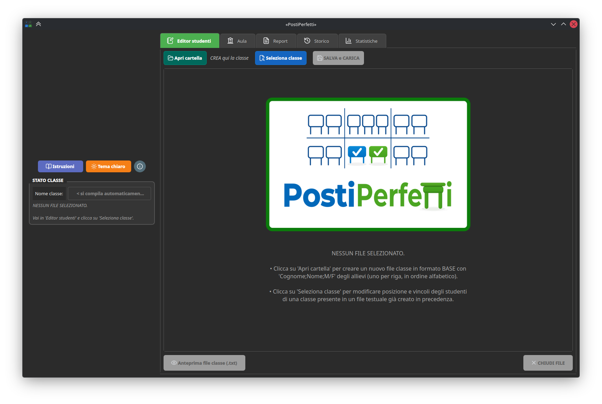
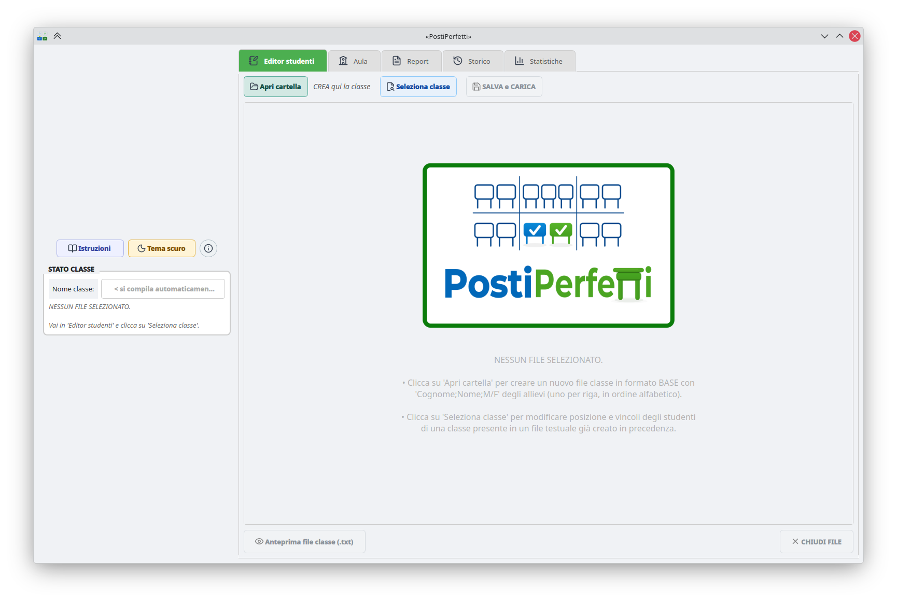

# 🪑 «PostiPerfetti»

> [!IMPORTANT]
>
> ✅ **«PostiPerfetti» è un programma gratuito e *open source* che utilizza un particolare algoritmo per aiutare il docente Coordinatore (o qualsiasi insegnante ne abbia la necessità) ad assegnare agli studenti il proprio posto in classe.** 
>
> ✅ Per funzionare, esso **richiede la creazione di un semplice file di testo con i dati essenziali degli alunni**: *cognome*, *nome*, *genere*. Tramite alcune funzioni intuitive sarà poi possibile aggiungere una serie di informazioni e vincoli ("affinità" e "incompatibilità" fra studenti, loro "posizione" rispetto alla cattedra, eventuale preferenza per "coppie miste maschio + femmina") per ottenere **una serie di assegnazioni quanto più in linea con i desiderata dell'insegnante**.
>
> ✅ Gli alunni vengono distribuiti automaticamente secondo la geometria scelta: **a coppie** oppure **a terzetti**. Il numero di posti per fila è adattabile alle esigenze dell’aula. **Una singola assegnazione richiede in genere da pochi secondi a qualche minuto.** Il tempo dipende in parte dal numero di "vincoli" impostati, ma soprattutto dalla **numerosità dei ragazzi** e da **quante assegnazioni sono già state salvate** nello Storico: più vicinanze sono già state sperimentate, infatti, più diventa impegnativo trovarne di inedite.
>
> 🔐 **«PostiPerfetti» lavora in locale e non invia dati studenti a servizi remoti**. Le operazioni di installazione e aggiornamento utilizzano la rete solo per scaricare il programma e le sue dipendenze.
> I file delle classi, lo Storico e gli altri dati dell'utente restano memorizzati localmente sul computer e **non vengono cifrati**. Devono quindi essere protetti come qualunque altro documento contenente dati personali. Per maggiori dettagli consulta "**[Dati, privacy e sicurezza](documentazione/DATI_PRIVACY_E_SICUREZZA.md)**".
>
> ### 🌐 Sito web del progetto: [www.postiperfetti.it](https://postiperfetti.it/)

> [!NOTE]
>
> A seconda delle tue preferenze, per usare l'interfaccia puoi selezionare un **🌙 Tema scuro** o un **☀️ Tema chiaro**, che apparirà come nei seguenti screenshot (clicca per allargare le immagini):
> 
> 
> 
> 

------

## 📥 DOWNLOAD

📦 **[Scarica «PostiPerfetti» per Windows e Linux](https://github.com/Omar-Ceretta/PostiPerfetti/releases/latest)**

💬 **[Come si installa, si avvia e si disinstalla](documentazione/INSTALLAZIONE_AVVIO_E_DISINSTALLAZIONE.md)** — tutorial passo per passo per Windows e Linux.

------

## [1] - GUIDA AL PRIMO UTILIZZO

> [!TIP]
>
> ### **1 ~ Prepara il file di testo della classe**

**Dopo aver installato e avviato il programma, clicca sul pulsante "Apri cartella"**. Il tuo file manager ti mostrerà la cartella che contiene le classi. Con un normale editor di testo — ad es. "Blocco note" (Notepad) su Windows o un editor equivalente su Linux — **crea un nuovo file di testo in formato `.txt` con il nome della tua classe** (ad es. `"Classe 1A.txt"`).

> 💡 **Nota per Windows:** l'estensione `.txt` potrebbe essere nascosta, quindi è possibile che il file ti appaia semplicemente come `"Classe 1A"`. È normale. NON usare invece programmi di videoscrittura come Microsoft Word o LibreOffice Writer: il file deve essere salvato come semplice testo.

**Dentro scrivi solo `"Cognome;Nome;Genere"`** **di ogni studente, uno per riga, in ordine alfabetico**. Separa i tre elementi con due punti e virgola (";") e non usare spazi, come nel seguente esempio:

| **Esempio di file base** |
| ------------------------ |
| `Alighieri;Dante;M`      |
| `Brontë;Charlotte;F`          |
| `D'Annunzio;Gabriele;M`   |
| `García Márquez;Gabriel;M`     |
| `Ortese;Anna Maria;F`        |
| *ecc.*            |

> [!TIP]
>
> ### 2 ~ Carica il file appena creato

**Clicca sul pulsante "Seleziona classe"** per scegliere il file che hai appena creato, in modo da poter aggiungere - grazie al programma stesso - tutti i vincoli necessari per gli studenti.

> [!TIP]
>
> 
>
> ### 3 ~ Imposta la POSIZIONE

Per ogni studente, **usa il menu a tendina per selezionarne la *posizione***:

- `NORMALE` = nessuna preferenza.
- **`PRIMA`** = **OBBLIGO di stare in prima fila** (utile ad es. per gli allievi più propensi a distrarsi, con difficoltà di vista o altri bisogni particolari).
- `ULTIMA` = preferenza per l'ultima fila (utile ad es. per allievi di alta statura o per altre esigenze).
- 🔴 **`FISSO`** = **posizione fissa in prima fila, nel primo banco a sinistra**.

> [!IMPORTANT]
>
> ### 🔴 La posizione "FISSO" (studenti con Bisogni Educativi Speciali)
>
> La posizione **FISSO** è pensata per gli allievi con **BES** o altre esigenze particolari che richiedono una collocazione stabile, vicina alla cattedra e costante nel tempo.
>
> **Come funziona:**
> - Lo studente FISSO viene **sempre assegnato al primo banco a sinistra della prima fila**, vicino alla cattedra. La sua posizione non cambia da una rotazione all'altra.
> - **L'algoritmo sceglie automaticamente il vicino diretto del FISSO**, bilanciando affinità, incompatibilità, vincoli di posizione e rotazioni già registrate nello Storico. Favorisce un allievo mai utilizzato prima in quel ruolo; tuttavia, quando tutti i candidati leciti sono già stati impiegati oppure altri vincoli lo rendono necessario, può riutilizzarne uno, segnalandolo esplicitamente nel Report. Anche nelle disposizioni "a coppie" il vicino diretto del FISSO avrà a sua volta un altro compagno al banco adiacente: in questo modo, se l'allievo BES dovesse temporaneamente uscire dall'aula, il compagno non resta isolato.

> - **NOTA 1: è possibile designare al massimo 1 studente FISSO** per classe.
>
> - **NOTA 2:** quando uno studente è impostato come FISSO, le sezioni "Incompatibilità" e "Affinità" nella sua scheda vengono **disabilitate**. Per influenzare chi gli siederà accanto, è sufficiente impostare i vincoli **sugli altri studenti** (ad es. impostando una "*Affinità di livello 3*" nelle schede dei compagni desiderati).

> [!TIP]
>
> ### 4 ~ Aggiungi le INCOMPATIBILITÀ

**Se è opportuno tenere SEPARATI alcuni allievi** (che in banco assieme rischierebbero di distrarsi o disturbare), **è consigliabile stabilire tra loro una "incompatibilità"**. 

Clicca su **"➕ Aggiungi INCOMPATIBILITÀ"** nella scheda dello studente. Apparirà una riga con:

- Un **menu a tendina** con tutti gli altri studenti della classe ⇾ seleziona il compagno.
- Un **menu livello** ⇾ scegli uno fra questi 3 gradi di incompatibilità:

| **Livello** | **Significato**              | **Quando usarlo**                                  |
| ----------- | ---------------------------- | -------------------------------------------------- |
| **1**       | Incompatibilità leggera      | Meglio se non vicini, ma accettabile se necessario |
| **2**       | Incompatibilità media        | Evitare se possibile, penalità significativa       |
| **3**       | **Incompatibilità ASSOLUTA** | **MAI vicini — vincolo inviolabile**               |

> 💡 **NOTA:** **Puoi aggiungere più incompatibilità per lo stesso studente**, cliccando di nuovo il bottone ➕.

> [!TIP]
>
> ### 5 ~ Aggiungi le AFFINITÀ

**Se è opportuno tenere UNITI certi allievi** (per "bilanciarne" i livelli e promuovere la collaborazione, per facilitare l'integrazione o altre ragioni), **è utile stabilire tra loro una "affinità"**. 

Segui la stessa procedura delle incompatibilità, usando **"➕ Aggiungi AFFINITÀ"**. 

I 3 livelli indicano quanto è desiderabile che i due studenti stiano vicini:

| **Livello** | **Significato**    | **Quando usarlo**                                        |
| ----------- | ------------------ | -------------------------------------------------------- |
| **1**       | Affinità leggera   | Per dare un piccolo bonus alla vicinanza                 |
| **2**       | Affinità buona     | Per dare un bonus più significativo alla vicinanza       |
| **3**       | **Affinità forte** | **Per far sì che l'algoritmo cerchi di metterli vicini** |

> 💡 **NOTA:** **Puoi aggiungere più affinità per lo stesso studente**, cliccando di nuovo il bottone ➕.

> [!TIP]
>
> ### 6 ~ BIDIREZIONALITÀ automatica

**Non devi preoccuparti di ripetere i vincoli.** Se imposti "D'Annunzio Gabriele incompatibile con Deledda Grazia (livello 3)", l'Editor aggiungerà **automaticamente** "Deledda Grazia incompatibile con D'Annunzio Gabriele (livello 3)". Lo stesso vale per le affinità, per le modifiche di livello e per le rimozioni.

> [!TIP]
>
> ### 7 ~ Rimuovere un vincolo

Clicca il bottone **"Rimuovi"** accanto al vincolo da eliminare. Il vincolo speculare sull'altro studente verrà rimosso automaticamente.

> [!TIP]
>
> ### 8 ~ Verifica e salva

- (OPZIONALE) Clicca su "**Preview file generato**" per vedere un'anteprima del file della classe che verrà creato.

- (OPZIONALE) Clicca su "**Dettaglio vincoli**" per avere una panoramica completa di tutti i vincoli inseriti.

- 👉 Clicca infine su **"SALVA e CARICA"** per salvare il file della classe.

A questo punto la classe verrà caricata nel programma e sarà **pronta per avviare le assegnazioni.**

------

> [!NOTE]
>
> ### ⚙️ Modifica dei vincoli in corso d'anno
>
> Se in futuro vorrai rimuovere, aggiungere o cambiare dei vincoli, basterà ricaricare nell'Editor il file della classe con il pulsante **"Seleziona classe"**. Le schede verranno popolate automaticamente con tutti i dati esistenti di ciascun allievo, pronte per essere modificate. 
>
> Se invece bisognasse rimuovere o aggiungere un allievo (per trasferimento, cambio sezione, bocciatura...), dovrai aprire manualmente il file di testo della classe e cancellarne la riga, oppure aggiungerlo (con `Cognome;Nome;Genere`).

------

## [2] - CARICAMENTO E CONFIGURAZIONE

### **Configura le opzioni**:

Dopo che avrai caricato la classe con "SALVA e CARICA", diventeranno attivi - nel pannello a sinistra - i riquadri "**Configurazione aula**", "**Genere misto**" e "**Modalità assegnazione**". Nel caso sia necessario, comparirà anche la voce "**Gestione numero dispari**".

- **"Configurazione aula"**: puoi fare in modo che gli allievi siano adiacenti "**a coppie**" oppure "**a terzetti**". Il programma calcolerà automaticamente il numero minimo di file necessarie per la tua classe. Puoi comunque modificare manualmente (con i pulsanti + e −) il **numero di banchi per fila**.

- **"Preferisci coppie miste (M+F)**": se attivi questo flag, **l'algoritmo preferirà coppie maschio-femmina** (non è un obbligo assoluto, ma un BONUS forte).

- **"Modalità assegnazione"**: puoi generare un solo mese alla volta (con la "modalità **Mensile**"), oppure decidere di generare più mesi in un colpo solo (con la "modalità **Annuale**"), fino a un massimo di 10. **Questa seconda opzione è quella consigliata**, non solo perché copre idealmente tutti i mesi dell'anno scolastico, da settembre a giugno, ma soprattutto perché è gestita dall'algoritmo in un modo più sofisticato rispetto alla modalità "Mensile", e può fornire assegnazioni più equilibrate e maggiormente in linea con i vincoli da te impostati.

- **"Gestione numero dispari"**: se è necessario un banco da 3 (trio), potrai **scegliere in quale posizione inserirlo**: 'davanti', 'al centro' o 'in fondo' all'aula.

------

## [3] - AVVIO DELL'ASSEGNAZIONE

Quando il file della classe sarà pronto e caricato, clicca su **"🚀 Assegna i posti!"**. 

💥 **L'algoritmo lavorerà in 4 tentativi progressivi, rispettando SEMPRE i vincoli "ASSOLUTI" (= 'posizione PRIMA', 'posizione FISSO' e 'incompatibilità 3') e facendo il possibile per NON RIPETERE COPPIE GIÀ FORMATE**.

| **Tentativo** | **Strategia**                                                |
| ------------- | ------------------------------------------------------------ |
| 1             | Tutti i vincoli attivi, nessuna coppia ripetuta              |
| 2             | Vincoli deboli (livello 1) rilassati                         |
| 3             | Vincoli medi (livello 2) rilassati                           |
| 4             | Solo vincoli ASSOLUTI, coppie ripetute ammesse con penalità progressiva |

- 💬 Al termine dell'elaborazione apparirà un **POPUP di riepilogo con le statistiche degli abbinamenti** creati. 
- ❗ Eventuali **coppie riutilizzate** saranno evidenziate in **colore ocra**.

> [!TIP]
>
> ### 🗓️ Modalità "Mensile" vs "Annuale"
>
> Come anticipato, il programma può assegnare i posti **un mese alla volta** (modalità "*Mensile*"), oppure **fino a 10 mesi contemporaneamente** (modalità "*Annuale*"). In ogni caso, i mesi generati verranno aggiunti in coda a quelli eventualmente già salvati nello Storico.
>
> 💡 **L'opzione *Mensile* è consigliata per fare le prime prove e prendere confidenza con il programma**.
> È l'ideale per capire come i vincoli impostati si traducano concretamente in assegnazioni, e ti consentirà di capire in maniera pragmatica come l'algoritmo, con la progressiva crescita delle assegnazioni salvate, metta in pratica la sua logica "flessibile". In questi primi approcci a «PostiPerfetti» imparerai il modo migliore per modificare i vincoli (diminuendone o aumentandone l'intensità) affinché il risultato rispecchi al meglio i tuoi desiderata.
>
> **L'opzione *Annuale* è invece consigliata quando sarai più consapevole di come lavora il programma** e di quali sono i risultati che esso è in grado di fornirti.
> Tieni presente che, al termine di un'elaborazione di questo tipo, si aprirà un'**anteprima** che ti mostrerà l'intera annata **mese per mese**, con le coppie formate e un Report con tutte le informazioni necessarie sul tipo di abbinamenti creati. Se ti convincerà, potrai cliccare su **"Accetta e salva nello Storico"** e tutti i mesi verranno salvati in ordine; altrimenti cliccando su **"Scarta tutto"** **non verrà salvato nulla** (= lo "Storico" resterà esattamente com'era). Mentre il programma lavora puoi sempre fermarlo con il pulsante **"⛔ Annulla"**.
>
> ⏳ **Quanto tempo richiede e perché conviene** — Preparare un'intera annata richiede **da pochi minuti fino a un MASSIMO di 10 MINUTI** per le classi più difficili. Si tratta, tuttavia, di tempo ben speso: non solo ottieni in un colpo solo (nella maggior parte dei casi) **tutti i mesi dell'anno** — e, quando proprio non è possibile, comunque **diversi mesi** — ma soprattutto **l'algoritmo può vagliare molte più combinazioni** rispetto all'assegnazione mese per mese: prova infatti tante "annate" diverse e ti propone quella con **meno ripetizioni di coppie**, meno incompatibilità tollerate e un maggior numero di affinità soddisfatte.

------

> [!NOTE]
>
> ### ⚙️ File di configurazione
>
> Tutte le modifiche ai file e ogni assegnazione salvata vengono memorizzate all'interno del file "postiperfetti_configurazione.json". Questo file NON deve essere aperto o modificato direttamente. Solo nel caso in cui si desideri cancellare l'intero "Storico" delle assegnazioni può essere eliminato, e verrà ricreato *da zero* dal programma in occasione della prima nuova assegnazione.

------

## [4] - VISUALIZZAZIONE DEI RISULTATI

### 🍀 La Tab "🏫 AULA"

La Tab "🏫 AULA" mostra la disposizione grafica dell'aula. Gli arredi (LIM, cattedra, lavagna) sono in basso, le file di banchi salgono verso l'alto. Da qui potrai agire sui pulsanti:

- **💾 Salva assegnazione**: salva la distribuzione degli allievi appena ottenuta nello "Storico" del programma, per consultarla in futuro e per memorizzare le coppie formate.
- **📊 Esporta Excel**: genera **un file .xlsx liberamente modificabile a seconda delle proprie esigenze**, con un layout ottimizzato per la stampa in A4.
- **📋 Esporta Report**: salva in formato `.txt` il report testuale completo con le caratteristiche degli abbinamenti effettuati.

### 🍀 La Tab "📊 REPORT"

[]

[]

La Tab "📊 REPORT" mostra il report testuale dettagliato con tutte le coppie formate, i punteggi, le note sui vincoli e il layout dell'aula in formato testo. **Le coppie eventualmente riutilizzate saranno evidenziate in colore ocra**.

### 🍀 La Tab "📚 STORICO"

[]

[]

La Tab "📚 STORICO" elenca tutte le assegnazioni salvate. Volendo, puoi **modificare il 'Nome' di ogni assegnazione** facendo doppio clic su di essa. Per ciascuna inoltre potrai agire sui pulsanti:

- **📋 Dettagli**: visualizza il report completo dell'assegnazione, che si può anche esportare.
- **🔍 Layout**: apre il layout grafico con la possibilità di esportare in Excel.
- **🗑️ Elimina**: rimuove l'assegnazione dallo "Storico" (consentendo di 'ri-abbinare' in futuro gli studenti che erano stati messi assieme in quella assegnazione).

### 🍀 La Tab "📊 STATISTICHE"

[]

[]

La Tab "📊 STATISTICHE" analizza l'intero "Storico" della classe (o di più classi) mostrando le coppie più frequenti, gli studenti più spesso in prima fila e le coppie mai formate. Utile per verificare l'equità e le caratteristiche delle rotazioni succedutesi nel tempo.

------

## [5] - FLUSSO DI LAVORO CONSIGLIATO

### 🔷 Prima assegnazione dell'anno (settembre):

1. **Prepara tramite "✏️ Editor studenti" il file della classe** con tutti i dati necessari (inclusa l'eventuale posizione FISSO per studente BES).

2. **Seleziona il file della classe** con "💾 SALVA e CARICA". Il programma **calcolerà il numero di file di banchi necessarie**.

3. Verifica la configurazione aula e, se necessario, modifica 'File di banchi' e/o 'Posti per fila'.

4. Assegna se necessario la posizione del 'trio' e l'**eventuale preferenza per le 'coppie miste'**.

5. **Avvia l'assegnazione, salvala nello "Storico" ed esportala in Excel**.

6. **Apri e modifica se necessario il foglio Excel, stampalo e posizionalo in classe.**

### 🔷 Assegnazioni successive (ottobre → giugno):

1. Mantieni lo stesso file della classe (o ricaricalo se hai aperto una nuova sessione del programma).
2. La rotazione è **automatica**: «PostiPerfetti» consulta lo Storico per evitare coppie già formate.
3. **Avvia tutte le assegnazioni necessarie, RICORDANDOTI DI SALVARLE** nello "Storico", ed esportale di volta in volta in Excel per un'eventuale modifica e la stampa.

**NOTA**: nel caso tu non abbia salvato in tempo i file Excel delle varie assegnazioni, potrai sempre farlo in un secondo momento, accedendo alla tab "📚 STORICO" e cliccando sul pulsante "🔍 Layout".

💡 **In alternativa al mese-per-mese**, con la modalità **"Annuale"** (vedi sezione [3]) puoi generare **l'intero anno in un'unica volta** e rivederlo prima di salvarlo: comodo a settembre per impostare da subito tutte le rotazioni.

> [!NOTE]
>
> ### ⚙️ Modifica dei vincoli o del numero di allievi in corso d'anno
>
> Se le dinamiche della classe dovessero cambiare, modifica con "✏️ Editor studenti" il file della classe — aggiornando 'posizione', 'incompatibilità' e 'affinità' — e poi salvalo. Se invece cambia il numero di allievi (un nuovo iscritto o un trasferimento), apri manualmente il file di testo dalla cartella delle classi, aggiungi o rimuovi la riga corrispondente e poi seleziona nuovamente il file nell'Editor.
>
> ⚠️ **Importante:** se hai già generato e salvato nello "Storico" delle assegnazioni che **non hai ancora usato davvero in classe**, è necessario **eliminarle** (pulsante "🗑️ Elimina" nella tab "📚 STORICO") prima di rigenerare. Così il programma — sia in modalità "Mensile" sia "Annuale" — **non eviterà coppie che in realtà non si sono mai sedute insieme**, ma soltanto quelle realmente già sperimentate.

------

------

## ⚠️ RISOLUZIONE DEI PROBLEMI

| **Problema**                                            | **Soluzione**                                                |
| ------------------------------------------------------- | ------------------------------------------------------------ |
| 💬 Popup che segnala errore al caricamento del file della classe | Il programma controlla rigorosamente la struttura e i vincoli del file e applica automaticamente soltanto le **correzioni sicure**. Se trova dati ambigui o non validi, rifiuta il nuovo file. Leggi il dettaglio del popup, correggi il file di testo e selezionalo nuovamente; le contraddizioni modificabili in "✏️ Editor studenti" devono essere risolte prima del salvataggio. |
| 🚫 Studente "non trovato" nei vincoli                    | Il nome nei vincoli deve corrispondere **esattamente** a Cognome + Nome (es: `Pasolini Pier Paolo`, non `Pasolini Pier`). |
| ❗ TROPPE COPPIE RIUTILIZZATE                            | Dipende soprattutto dalla **dimensione della classe**: meno alunni significa meno combinazioni possibili, perciò dopo qualche mese è matematicamente inevitabile riusare qualche coppia. Non è un errore di impostazione. Declassare qualche incompatibilità di livello 3 a livello 2 può dare un po' di respiro, ma NON elimina questo limite. |
| ‼️ L'ASSEGNAZIONE FALLISCE IN TUTTI I TENTATIVI | La combinazione di vincoli e la geometria scelta (Coppie / Terzetti) potrebbe non ammettere una soluzione, oppure i limiti temporali della ricerca potrebbero non aver consentito di trovarla. Controlla soprattutto le **incompatibilità assolute** (livello 3) e gli studenti con posizione **PRIMA**. Se questi ultimi non entrano tutti nella prima fila, considera di ridurne il numero oppure aumenta i posti per fila (se la disposizione dell'aula lo consente). In modalità terzetti, quando l'opzione è disponibile, prova anche a cambiare la composizione del blocco restante (**1 coppia / 2 quartetti**). |
| 🔴 Impossibile impostare vincoli per studente FISSO      | È normale: la scheda dello studente FISSO disabilita incompatibilità e affinità. Per influenzare chi gli siederà accanto, imposta i vincoli **nella scheda degli altri studenti**. |

------

------

## 📚 Altri documenti

| Documento | Cosa contiene |
|---|---|
| **[Installazione e avvio](documentazione/INSTALLAZIONE_AVVIO_E_DISINSTALLAZIONE.md)** | Installazione, aggiornamento e disinstallazione su Windows e Linux, passo per passo. |
| **[CHANGELOG.md](CHANGELOG.md)** | Le novità e le correzioni di ogni versione pubblicata. |
| **[SECURITY.md](SECURITY.md)** | Come segnalare un problema di sicurezza — e, soprattutto, **quali dati non allegare mai** a una segnalazione. |
| **[TERZE_PARTI.md](TERZE_PARTI.md)** | Le librerie, il carattere e le icone di altri autori usati dal programma, con le rispettive licenze. |
| **[LICENSE](LICENSE)** | Il testo completo della GNU GPL versione 3. |

La documentazione tecnica più estesa (funzionamento dell'algoritmo, mappa dei moduli, trattamento dei dati) si trova nella cartella **[`documentazione/`](documentazione/)**.

------

«PostiPerfetti» — Sviluppato in Python dal prof. Omar Ceretta

🇮🇹 Istituto Comprensivo di Tombolo e Galliera Veneta (PADOVA) 🇮🇹

LICENZA: GNU GPLv3
