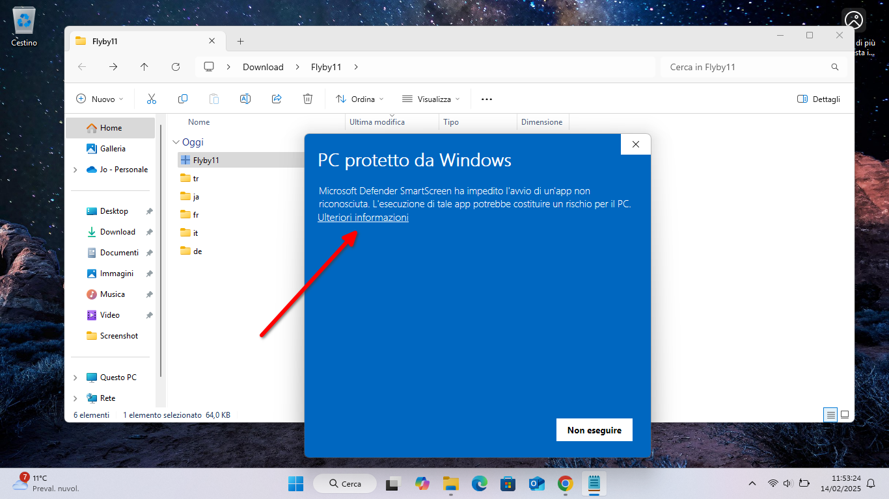

# 🖥️ «PostiPerfetti» — Installazione e avvio

---

<table border="0"><tr><td>

</td><td>

## Installazione su Windows

</td></tr></table>

### ✰ Requisiti

- **Windows 10 versione 1809 o successiva**, oppure **Windows 11**.
- Sistema compatibile con applicazioni **x64 (64 bit)**.

### ✰ Installazione

1. Vai alla **[Release più recente](https://github.com/Omar-Ceretta/PostiPerfetti/releases/latest)** e, nella sezione *Assets*, scarica il file **`PostiPerfetti-<versione>-setup.exe`** (ad es. `PostiPerfetti-1.0-setup.exe`).
2. Fai doppio clic sul file scaricato.
3. Segui le istruzioni del programma di installazione.

### ❗ Nota sulla sicurezza (SmartScreen e antivirus)

La versione attuale di «PostiPerfetti» non è firmata digitalmente con un certificato commerciale. Per questo motivo Windows SmartScreen o un software antivirus possono mostrare un avviso prima dell'esecuzione.



Scarica l'installer soltanto dalla **Release ufficiale di «PostiPerfetti»** su GitHub.

**Se appare l'avviso di Windows SmartScreen:**

1. verifica che il file provenga dalla Release ufficiale;
2. nella schermata blu fai clic su **«Ulteriori informazioni»**;
3. per procedere fai clic su **«Esegui comunque»**.

**Se un antivirus blocca o mette in quarantena il file**, non disattivare la protezione del sistema. 
Verifica di aver scaricato l'installer dalla Release ufficiale e, per controllarne l'integrità, confronta il suo SHA-256 con quello pubblicato insieme all'installer. 
Calcolando il checksum di un file e confrontandolo con quello originale è infatti possibile verificare che il software non sia stato manomesso o danneggiato.
Solo dopo questa verifica valuta se autorizzare il programma tramite le funzioni del tuo antivirus.

### ✰ Aggiornamento

Per aggiornare «PostiPerfetti» a una nuova versione, scarica dalla **[Release più recente](https://github.com/Omar-Ceretta/PostiPerfetti/releases/latest)** il nuovo file `PostiPerfetti-<versione>-setup.exe` ed eseguilo normalmente.

L'installazione esistente viene riconosciuta automaticamente e aggiornata. **Classi, impostazioni e log vengono preservati**.

### ✰ Disinstallazione

Puoi disinstallare «PostiPerfetti» dalle normali **Impostazioni di Windows** oppure tramite la voce **«Disinstalla PostiPerfetti»** creata nel menu Start.

Durante la disinstallazione ti verrà chiesto se desideri eliminare anche i dati personali del programma:

- scegli **No** per conservare classi, impostazioni, Storico e log in vista di una futura reinstallazione;
- scegli **Sì** per eliminare anche questi dati.

> **Attenzione:** scegliendo **Sì**, i dati contenuti nelle cartelle `classi`, `stato` e `log` vengono eliminati definitivamente.

---

<table border="0"><tr><td>

</td><td>

## Installazione su Linux

</td></tr></table>

L'installazione su Linux è gestita da uno script Bash distribuito insieme alla Release ufficiale.

«PostiPerfetti» supporta le principali distribuzioni delle famiglie **Debian/Ubuntu, Fedora, Arch Linux e openSUSE**. È stato testato su Debian 13.6 (e le sue derivate LMDE 6 e MX Linux 25.2), Ubuntu 26.04 (e le sue derivate Linux Mint 22.3, Zorin OS 18.1 e POP!_OS 22.04), Fedora 44, Arch Linux e openSUSE Leap 16. Il codice dell'installer viene verificato automaticamente su Ubuntu 24.04, Fedora 44, Arch Linux e openSUSE Tumbleweed.

### ✰ Requisiti

«PostiPerfetti» supporta **Python 3.10, 3.11, 3.12, 3.13 e 3.14**.

L'installer verifica automaticamente i prerequisiti necessari. Se ne manca qualcuno e la distribuzione è riconosciuta, propone di installarlo direttamente, chiedendo conferma prima di usare `sudo`.

> L'installer va avviato come **utente normale**, non con `sudo`.

### ✰ Installazione

Apri un terminale e usa uno dei due metodi seguenti.

Con `wget`:

```bash
wget -O install.sh \
  https://github.com/Omar-Ceretta/PostiPerfetti/releases/latest/download/install.sh

bash install.sh
```

Oppure con `curl`:

```bash
curl -fL -o install.sh \
  https://github.com/Omar-Ceretta/PostiPerfetti/releases/latest/download/install.sh

bash install.sh
```

Il programma viene installato normalmente nella Home dell'utente, in:

```text
~/PostiPerfetti
```

L'installer scarica automaticamente il pacchetto corrispondente alla propria Release (ad es. `PostiPerfetti-1.0-linux.tar.gz`), ne verifica l'integrità e la versione e prepara l'ambiente Python necessario. Al termine propone di avviare subito «PostiPerfetti».

Una volta completata l'installazione, l'uso del programma non richiede una connessione a Internet.

### ✰ Aggiornamento

Per aggiornare «PostiPerfetti» è sufficiente scaricare ed eseguire nuovamente l'`install.sh` della Release più recente con uno dei comandi precedenti.

L'installazione esistente viene riconosciuta automaticamente e **classi, impostazioni e log vengono preservati**.

### ✰ Disinstallazione

Per una disinstallazione normale:

```bash
~/PostiPerfetti/uninstall.sh
```

Vengono rimossi il programma, il relativo ambiente virtuale e l'integrazione desktop. Sono invece conservati:

```text
~/PostiPerfetti/classi
~/PostiPerfetti/stato
~/PostiPerfetti/log
```

Questi dati permettono una successiva reinstallazione senza perdere classi, impostazioni e Storico.

Per eliminare anche tutti i dati locali di «PostiPerfetti», esegui:

```bash
~/PostiPerfetti/uninstall.sh --purge
```

> **Attenzione:** `--purge` elimina definitivamente classi, impostazioni, Storico e log. Usalo soltanto se non desideri conservarli.

<details>
<summary><b>🔎 Cosa controlla l'installer</b></summary>

<br>

Prima di concludere l'installazione, lo script:

- controlla la versione di Python e la capacità di creare ambienti virtuali;
- verifica gli strumenti di sistema necessari;
- scarica il pacchetto appartenente alla propria Release;
- verifica lo **SHA-256** del pacchetto e la versione del codice contenuto;
- prepara o riutilizza `~/PostiPerfetti/.venv`;
- installa le versioni esatte definite in `requirements.txt`;
- esegue `pip check`;
- verifica PySide6 e XlsxWriter;
- controlla il runtime grafico Qt e le dipendenze del plugin `libqxcb.so`;
- esegue un breve test di inizializzazione dell'interfaccia grafica.

Se una verifica essenziale fallisce, l'installazione viene interrotta invece di essere dichiarata completata.

I privilegi amministrativi, quando necessari, vengono richiesti soltanto per installare prerequisiti di sistema tramite il gestore dei pacchetti. I file di «PostiPerfetti» restano nella cartella dell'utente.

</details>

<details>
<summary><b>⚒️ Per utenti esperti: esecuzione manuale dal sorgente</b></summary>

<br>

È possibile scaricare il ramo `main` ed eseguire direttamente il launcher Python:

```bash
wget -O postiperfetti-main.tar.gz \
  https://github.com/Omar-Ceretta/PostiPerfetti/archive/refs/heads/main.tar.gz

tar xzf postiperfetti-main.tar.gz
cd PostiPerfetti-main

python3 -m venv .venv
source .venv/bin/activate
python -m pip install -r requirements.txt

python moduli/postiperfetti_launcher.py
```

Questa modalità è pensata per sviluppo e collaudo e **non equivale all'installazione Linux ufficiale**: non esegue la gestione dei prerequisiti di sistema, la verifica preventiva del runtime Qt o l'integrazione con il Menu applicazioni.

Per installare o aggiornare normalmente il programma è preferibile usare l'`install.sh` della Release ufficiale.

</details>

<details>
<summary><b>❓ Risoluzione dei problemi</b></summary>

<br>

🔹 **Versione di Python non compatibile**

Questa release richiede Python da **3.10 a 3.14**:

```bash
python3 --version
```

Se il Python di sistema è già presente ma non compatibile, l'installer non tenta di sostituirlo automaticamente.

**Problemi con `venv` o `pip`**

Su Debian, Ubuntu e derivate può essere necessario:

```bash
sudo apt install python3-venv
```

Sulle distribuzioni riconosciute è lo stesso installer a proporre l'installazione dei prerequisiti mancanti.

🔹 **Errore durante l'installazione delle dipendenze Python**

Controlla la connessione a Internet e i messaggi prodotti da `pip`, quindi riesegui l'installer della Release ufficiale.

🔹 **Errore Qt/XCB o mancato avvio dell'interfaccia**

Quando disponibile, la diagnostica dell'installazione viene salvata in:

```text
~/PostiPerfetti/log/diagnostica_installazione_qt.log
```

Se invece l'applicazione si chiude subito dopo l'avvio, il launcher può salvare:

```text
~/PostiPerfetti/log/diagnostica_avvio.log
```

Controlla questi log per capire la natura del problema e, nel caso, installare eventuali dipendenze mancanti.

🔹 **Ambiente Python danneggiato dopo l'installazione**

Il launcher controlla l'ambiente e può proporre una riparazione delle dipendenze. Se il problema riguarda Python di sistema o librerie native Qt, riesegui l'installer Linux ufficiale della tua distribuzione.

</details>
